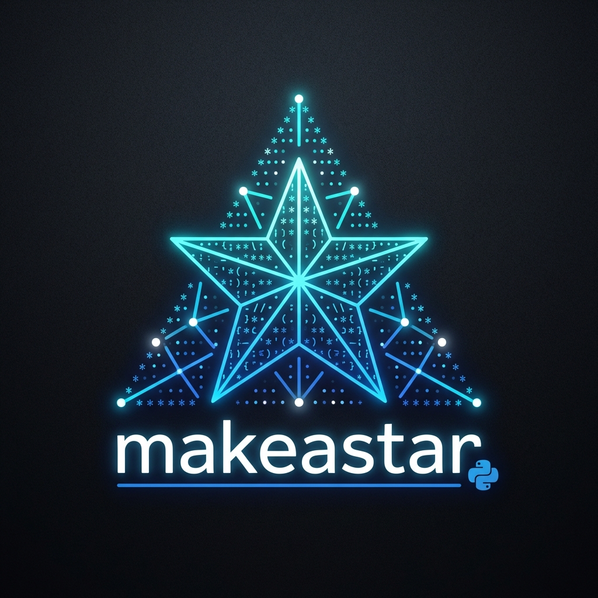

# Contributing to makeastar 

Thank you for your interest in contributing to `makeastar`! We welcome contributions from everyone.

## how to Contribute

1. **Fork the repository** to your own GitHub account.
2. **Clone the project** to your machine.
3. **Create a branch** locally with a succinct name that describes your change.
4. **Commit changes** to the branch.
5. **Push changes** to your fork.
6. **Open a Pull Request** in our repository.

## Code Style

- Please use English for all code comments and documentation.
- Keep the code minimalist and optimized. We prefer one-liners or highly efficient generator expressions over verbose loops.
- Follow PEP 8 style guidelines where possible.

## Reporting Bugs

If you find a bug, please create an issue describing:
- What you did.
- What you expected to happen.
- What actually happened.
- Your environment (OS, Python version).

Thank you for helping to make `makeastar` better!
